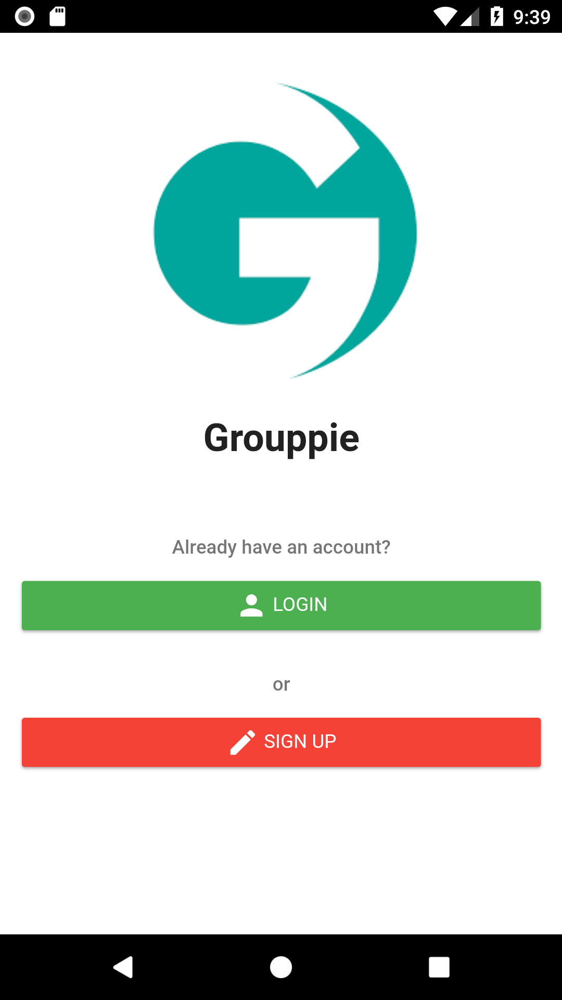
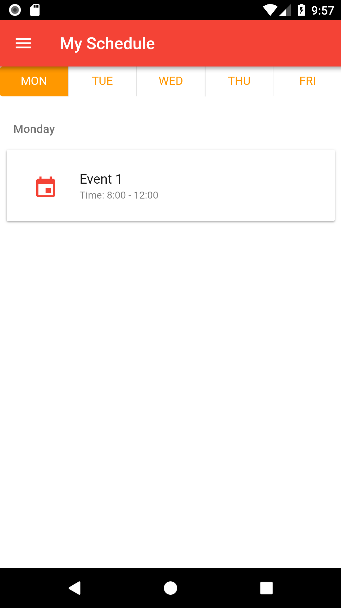
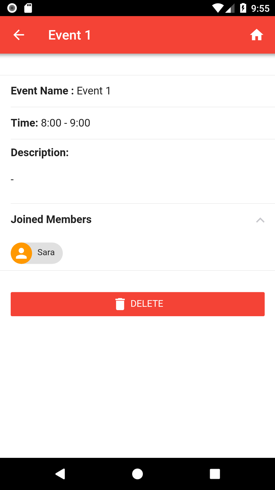

# Group Scheduler Mobile App

## ICCS 485: Assignment 3
A group scheduler app where user can
* Create/Delete Group
* Create/Delete Group Event
* Join/Leave Group
* Join/Leave Event
* View their schedule based on joined events
* View group events

### How to run on local
```
npm install && npm run dev
```
Then open your browser and go to [http://localhost:8080](http://localhost:8080) and use inspect mode with device screen.

|  |  | 
|:---:|:---:|:---:|
| Home page | My schedule page | View event page |

## Note
This project is a hybrid app which uses
* Framework7-vue to develop
* Cordova to deploy to mobile
* Google firebase as backend
